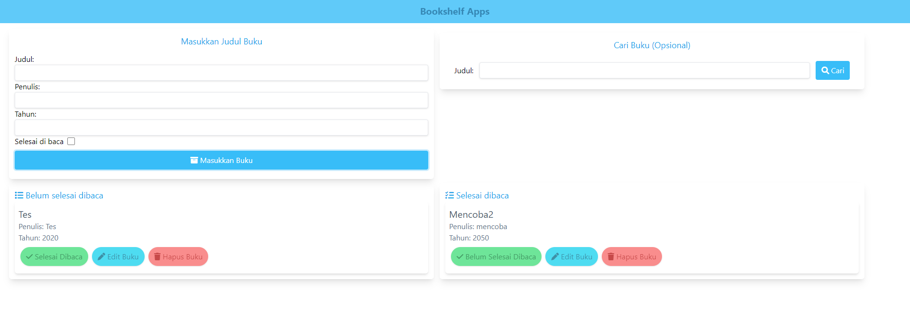
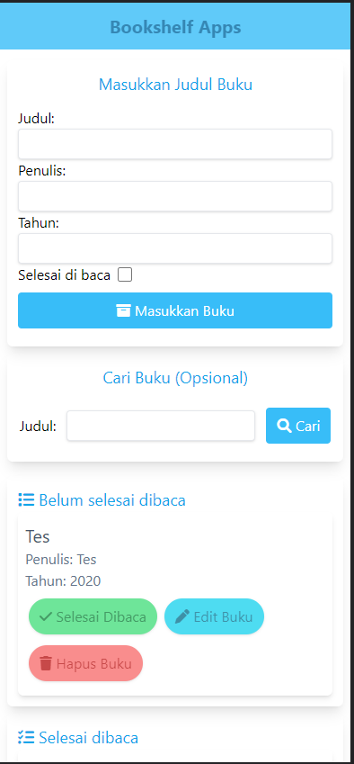
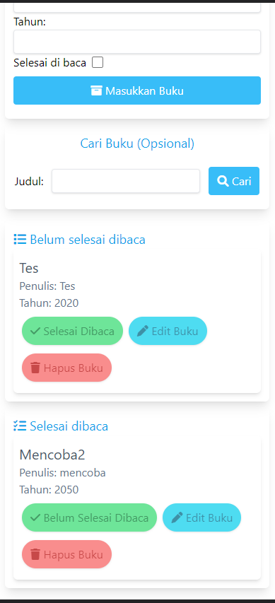

## Bookshelf
Merupakan sebuah website sederhana yang dibuat dengan harapan agar tuntas di Submission Front End Dasar dari Dicoding.

## Preview dari Bookshelf

> Versi Desktop

> Versi Mobile

## Library yang digunakan

- Tailwind CSS (Pembuatan UI)
- FontAwesome (Icon)